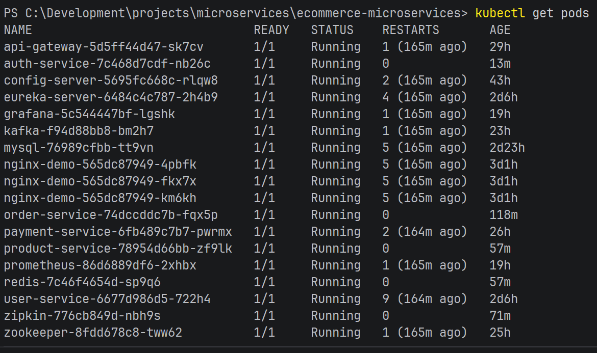
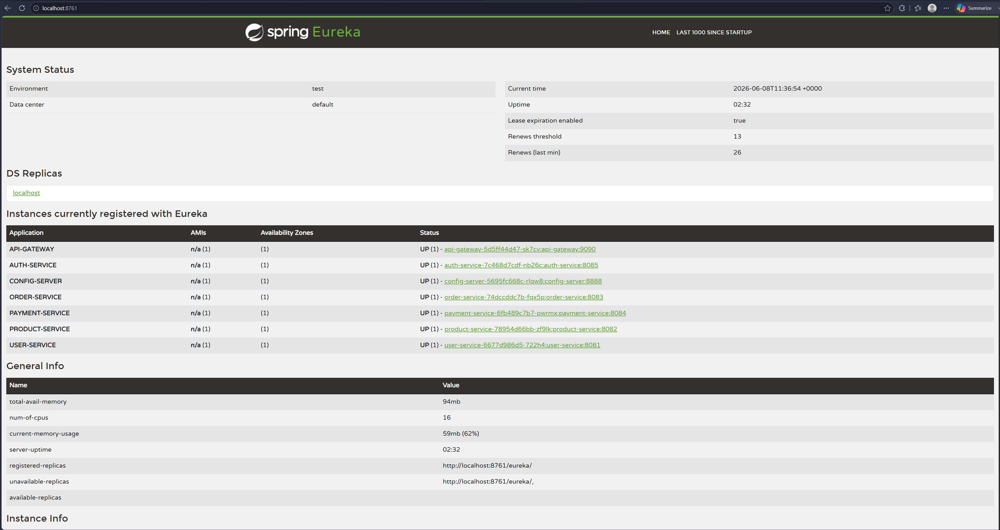
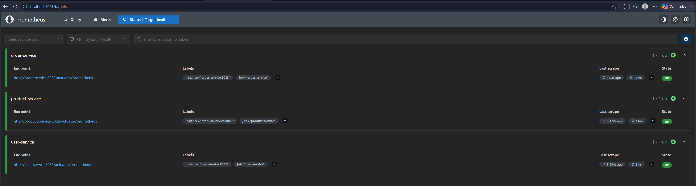
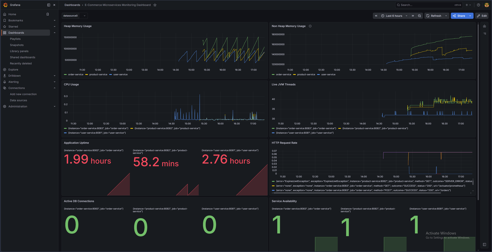
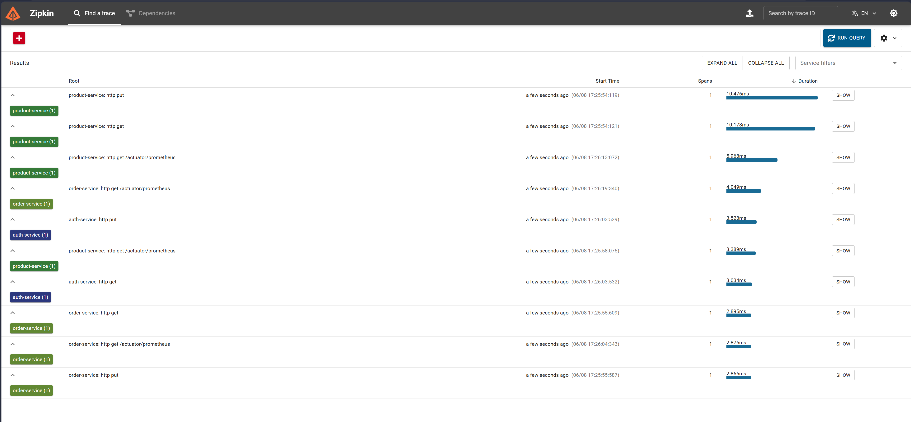
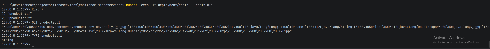
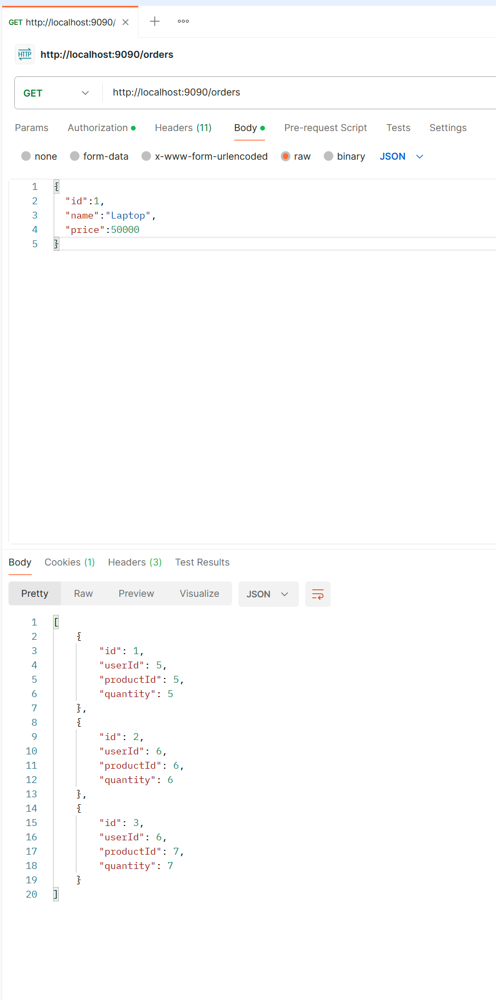

# Ecommerce Microservices Platform

## Overview

A production-style Ecommerce Backend built using Spring Boot Microservices, Spring Cloud, Docker, Kubernetes, Kafka, Redis, Zipkin, Prometheus, and Grafana.

This project demonstrates modern cloud-native architecture patterns including:

- Service Discovery
- Centralized Configuration
- API Gateway Routing
- JWT Authentication
- Distributed Caching
- Event-Driven Communication
- Distributed Tracing
- Metrics & Monitoring
- Containerization
- Kubernetes Orchestration

---

# Architecture

```text
                                Client
                                   |
                                   v
                            API Gateway
                                   |
        --------------------------------------------------
        |               |               |               |
        v               v               v               v

   Auth Service     User Service   Product Service   Order Service
                                            |              |
                                            |              v
                                            |       Payment Service
                                            |
                                            v
                                          Redis

        --------------------------------------------------
                     Infrastructure Layer
        --------------------------------------------------

              Eureka Server (Service Discovery)

              Config Server (Centralized Config)

                     MySQL Database

                    Kafka + Zookeeper

                         Zipkin

                      Prometheus

                        Grafana
```

---

# Features

## Authentication

- JWT Access Token generation
- Refresh Token support
- User registration and login
- Authentication through API Gateway

## Service Discovery

- Eureka Server
- Automatic service registration
- Dynamic service lookup

## Configuration Management

- Spring Cloud Config Server
- Centralized application configuration

## API Gateway

- Single entry point
- Request routing
- Security integration

## Redis Caching

- Product caching using Spring Cache
- Reduced database hits
- Faster product retrieval

## Kafka Messaging

- Asynchronous communication
- Order event publishing
- Payment event consumption

## Distributed Tracing

- Zipkin integration
- Request tracing across microservices

## Monitoring

- Prometheus metrics collection
- Grafana dashboards
- JVM monitoring
- HTTP request monitoring

---

# Microservices

## Auth Service

- Register user
- Login user
- Generate JWT Access Token
- Generate Refresh Token

## User Service

- Create users
- Retrieve users

## Product Service

- Create products
- Retrieve products
- Redis caching

## Order Service

- Create orders
- Publish Kafka events

## Payment Service

- Consume Kafka events
- Process payment events

---

# Technology Stack

## Backend

- Java 21
- Spring Boot 3
- Spring Cloud

## Security

- Spring Security
- JWT Authentication

## Database

- MySQL

## Messaging

- Apache Kafka
- Apache Zookeeper

## Caching

- Redis

## Observability

- Zipkin
- Prometheus
- Grafana

## DevOps

- Docker
- Kubernetes
- Maven

---

# Kubernetes Deployment

The platform is deployed on Kubernetes using:

- Deployments
- Services
- Internal DNS
- Cluster Networking
- Service Discovery

### Deployed Components

- API Gateway
- Config Server
- Eureka Server
- Auth Service
- User Service
- Product Service
- Order Service
- Payment Service
- MySQL
- Kafka
- Zookeeper
- Redis
- Zipkin
- Prometheus
- Grafana

---

# API Examples

## Register User

```http
POST /auth/register
```

### Request

```json
{
  "username": "admin",
  "password": "admin123",
  "role": "ADMIN"
}
```

---

## Login

```http
POST /auth/login
```

### Request

```json
{
  "username": "admin",
  "password": "admin123"
}
```

---

## Create Product

```http
POST /products
```

### Request

```json
{
  "id": 1,
  "name": "Laptop",
  "price": 50000
}
```

---

## Get Product

```http
GET /products/1
```

---

## Create Order

```http
POST /orders
```

---

# Monitoring Dashboard

The application is monitored using Grafana dashboards powered by Prometheus metrics.

Metrics include:

- JVM Heap Usage
- JVM Non-Heap Usage
- CPU Usage
- Live JVM Threads
- Application Uptime
- HTTP Request Rate

---

# Screenshots

## Kubernetes Pods



## Eureka Dashboard



## Prometheus Targets



## Grafana Dashboard



## Zipkin Tracing



## Redis Cache



## JWT Authentication



---

# Project Highlights

✅ Spring Boot Microservices

✅ API Gateway

✅ Eureka Service Discovery

✅ Config Server

✅ JWT Authentication

✅ Redis Caching

✅ Kafka Event Streaming

✅ Zipkin Distributed Tracing

✅ Prometheus Monitoring

✅ Grafana Dashboards

✅ Docker Containerization

✅ Kubernetes Deployment

---

# Future Enhancements

- AWS EKS Deployment
- AWS RDS MySQL
- AWS ElastiCache Redis
- AWS MSK Kafka
- CI/CD using GitHub Actions
- Helm Charts
- Terraform Infrastructure

---

# Author

**Aiswarya George**

Cloud & DevOps Engineer | Java Full Stack Developer